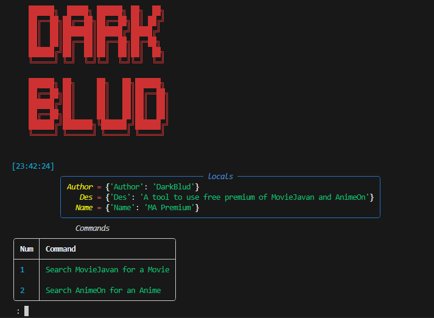

# MovieJavan-Premium

> [!TIP]
> This script also has the premium of AnimeOn 




> [!TIP]
> If you have any issues make sure to add them to Issues section
--------------------------------------------------------
### compatibility:
   - Windows
   - Termux ( Android )
   - Linux
   - Mac
--------------------------------------
### Explanation :
***so basicly what does this script do? we found the whole database of MovieJavan and place them in some text file then our script search the name of the movie or anime user wants then search it and gives the direct link to watch it***
> [!caution]
> Make sure to read this part

**for watching the movie you need to open the link that script gives you then open it in your browser search the name of movie or anime then select the quality you want (1080 or 720 or...) after that copy the link place it in VLC or open it in browser or download it and watch it peacfuly for FREE**
> [!caution]
> we have the owners permission I place the screenshot here


--------------------------------
### How to use : 
  1. First download or clone the repo
  2. Extract it and open the directory
  3. Install req libraries by ``` pip install -r requirements.txt ``` ( ***in command prompt or terminal in same directory*** )
  4. Run the script by ``` python Free-Premium-MA.py ```
  5. Choose the options and wait for program do find the data you want

> [!caution]
> This script needs active internet connection and you need to wait becuase of big database check
----------------------------------- 
# Author : Darkblud 
# Telegram : [Darkblud](https://t.me/darkblud)
